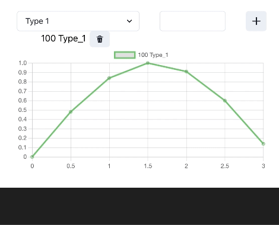

# react-scopes

A simple web-based plotting tools. Demonstrates how to load signals into a list and
plot them. Items can be deleted from the list.





This project is build with [vite](https://vitejs.dev/). The dependencies are in `package.json`.

Start it with
```
    npm run dev
```

